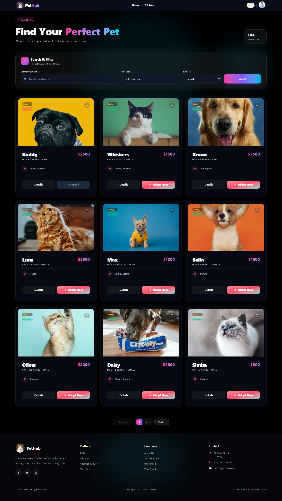
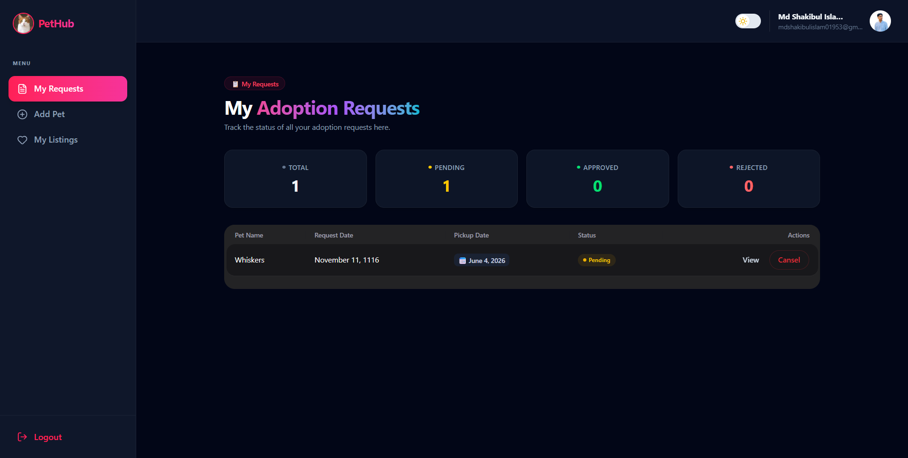

# 🐾 PatHub: A Full-Stack Pet Hub Platform

petHub is a comprehensive PetHub Platform built using the MERN stack. This application connects pet lovers with pets in need of a home. It provides a seamless interface for users to browse, search, and request adoption, while pet owners can efficiently manage their listings and adoption requests.

## 🚀 Live URL

👉 [PatHub Live Link](https://pet-hub-client.vercel.app)

## 🎯 Purpose

The goal of this platform is to simplify the pet adoption process by providing a secure, user-friendly, and centralized space for pet owners and adopters to interact, ensuring every pet finds a loving home.

---

## 📸 Screenshots

Here are some glimpses of the PatHub platform:

### 🏠 Home Page & Hero Section


### 🐾 Advanced Pet Browsing & Filters


### 📊 Owner Dashboard & Request Management

## 

## ✨ Key Features

- **Advanced Pet Browsing:** Search pets by name, filter by species, and view detailed profiles.
- **Secure Authentication:** JWT-based authentication with Google Login support and HTTPOnly cookies for security.
- **Robust CRUD Operations:** Owners can create, read, update, and delete (CRUD) pet listings.
- **Request Management:** Authenticated users can request adoption; owners can approve/reject these requests in real-time.
- **Responsive Design:** Fully optimized interface for mobile, tablet, and desktop devices.

---

## 🛠 Tech Stack

### Frontend

- **React.js** (Vite)
- **Tailwind CSS** & **DaisyUI**
- **React Router**
- **Axios** (for API requests)
- **TanStack Query** (for data fetching)
- **BeterOth** (for Authentication)

### Backend

- **Node.js**
- **Express.js**
- **MongoDB** (Database)
- **JWT** (JSON Web Token)
- **Dotenv** (Environment variables)

---

## 📦 NPM Packages Used

- `react` & `react-router-dom`
- `axios`
- `@tanstack/react-query`
- `firebase`
- `react-hook-form`
- `react-toastify` (for notifications)
- `framer-motion` (for animations)
- `jsonwebtoken`
- `cors` & `dotenv`
- `mongoose`

---

## ⚙️ How to Run Locally

Follow these steps to set up and run the project locally on your machine:

### 1. Clone the Repository

```bash
https://github.com/themdshakibul/PetHub-Client.git
```
